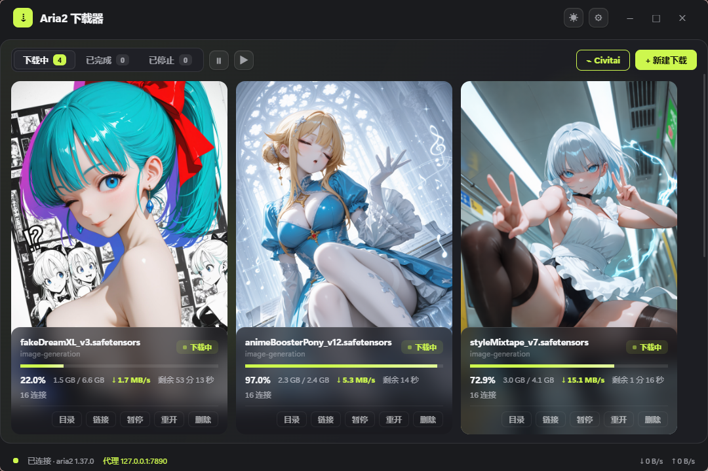
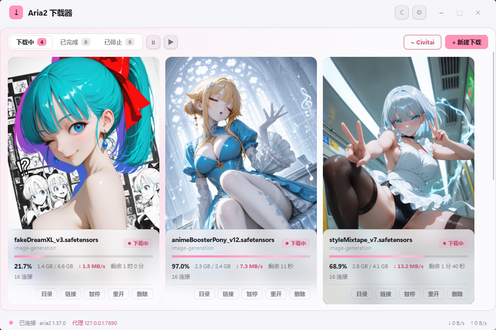
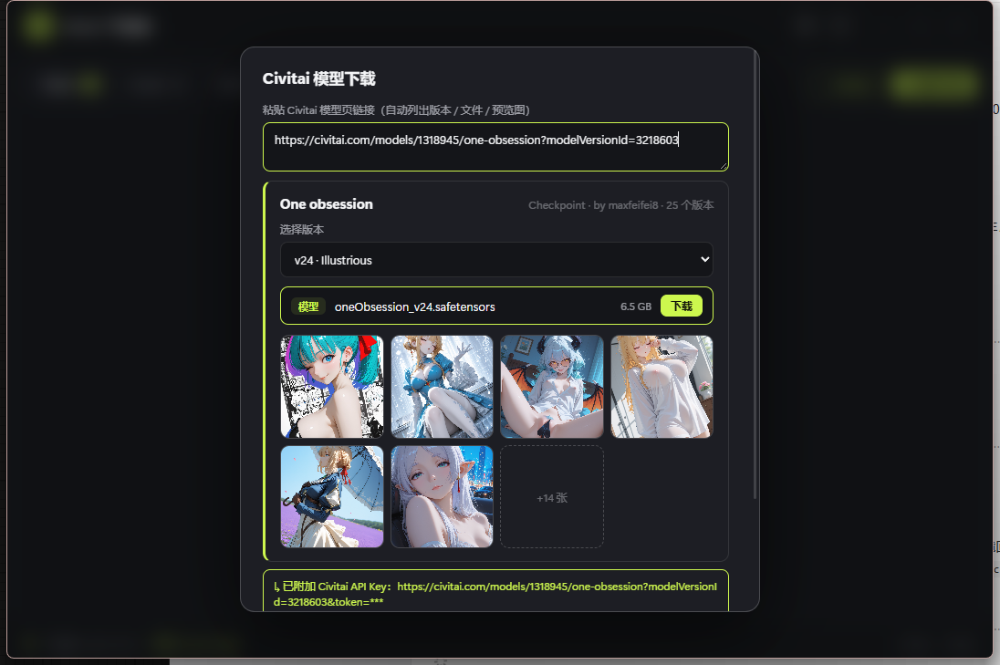

# cvia · Aria2 下载器

基于 [Tauri 2](https://tauri.app) + [aria2](https://aria2.github.io) 的 Windows 桌面下载器。
粘贴链接即下，支持 Civitai 模型页一键解析，深浅双主题。

| 深色 | 亮色 |
| --- | --- |
|  |  |



粘贴 Civitai 模型页链接，自动解析版本 / 文件 / 预览图，选中即下。

## 功能

- **直链 / 磁力 / Civitai 模型页**：新建下载里粘贴任意一种；Civitai 链接自动拉取
  模型信息（版本、文件大小、预览图网格），按文件一键下载，API Key 自动附加并在
  界面打码显示
- **卡片式任务列表**：Civitai 任务以模型预览图铺底，下载信息悬浮在主题色磨砂
  玻璃层上；进度 / 速度 / 剩余时间实时刷新
- **下载中沉浸氛围**：有任务在跑时，一层主题色光斑从左下角拉起并缓慢漂移，
  全部完成后收回
- **深浅双主题**：一键切换，跟随系统并记住选择
- **aria2 引擎托管**：内置 aria2c，自动断点续传、失败自动重试（退避 3 次）、
  会话恢复；本地代理自动探测（v2ray / clash 常用端口），切换代理无需重启应用
- **HuggingFace 链接预处理**：`/blob/` 网页链接自动转 `/resolve/` 直链
- **托盘常驻**：关闭窗口继续下载，托盘菜单暂停 / 继续 / 退出
- **全局单实例**：重复启动自动唤起已有窗口

## 下载

到 [Releases](../../releases) 页面下载最新安装包：

- `cvia_x.y.z_x64-setup.exe`（NSIS，推荐）
- `cvia_x.y.z_x64_en-US.msi`

> 首次启动如遇 SmartScreen 提示，选择「仍要运行」（未签名构建）。

## Agent 控制通道（调试用）

内置一个只监听 `127.0.0.1` 的本地控制服务，让 AI Agent / 脚本以
**和 GUI 用户完全相同的通道**操控应用（不绕过应用直连 aria2 RPC）：

```bash
curl -s http://127.0.0.1:33211/help          # 完整自描述
curl -s "http://127.0.0.1:33211/page"        # 结构化页面快照（弹窗/控件/任务）
curl -X POST http://127.0.0.1:33211/cmd -H "Content-Type: application/json" \
  -d '{"type":"batch","payload":{"steps":[
    {"type":"click","payload":{"selector":"[data-testid=btn-add]"}},
    {"type":"fill","payload":{"selector":"[data-testid=input-uris]","value":"https://example.com/a.zip"}},
    {"type":"click","payload":{"selector":"[data-testid=btn-submit-add]"}}
  ]}}'
```

每条指令的响应都自带执行后的完整页面快照（弹窗意外消失一眼可见）。
详见 [CONTROL.md](CONTROL.md)。

## 从源码构建

```bash
# 需要：Node 18+ / pnpm / Rust (msvc toolchain)
pnpm install
pnpm tauri dev      # 开发（热更新）
pnpm tauri build    # 产出 NSIS / MSI 安装包（src-tauri/target/release/bundle/）
```

aria2c 引擎二进制已包含在 `src-tauri/binaries/`，无需额外准备。

## 目录速览

```
src/                  前端（React + TypeScript）
  api.ts              aria2 JSON-RPC 客户端（WebSocket）
  civitai.ts          Civitai API 解析 / 封面映射
  control.ts          Agent 控制桥（与 GUI 同通道）
  fake.ts             假下载（离线调视觉用）
src-tauri/
  src/main.rs         引擎托管 / 托盘 / 代理协商
  src/control.rs      本地控制服务（HTTP / 图片代理 / help）
```

## 许可

本仓库代码以 [MIT](LICENSE) 授权。

内嵌的 aria2c 引擎（`src-tauri/binaries/`）遵循
[GPLv2 + OpenSSL 例外](https://github.com/aria2/aria2/blob/master/COPYING)，
其许可文本见仓库内 `COPYING`；相关声明见 [NOTICE.md](NOTICE.md)。
